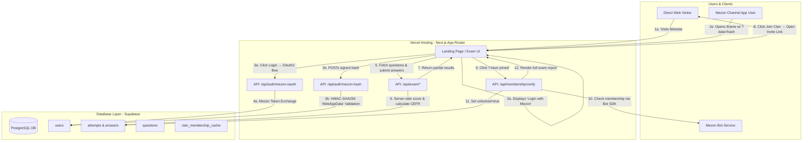

# Technical Architecture & Implementation Plan: Mezon English Exam Channel App

**Tech Stack:** Next.js (App Router), Vercel, Supabase (PostgreSQL & Auth), Mezon SDK / Channel App Auth  
**Version:** 1.0  
**Target:** 1-2 Week MVP

---

## 1. High-Level Architecture Diagram



---

## 2. Next.js App Directory Structure

```
mezon-app-sample/
├── app/
│   ├── layout.tsx                  # Root layout, theme, providers
│   ├── page.tsx                    # Landing / Welcome page
│   ├── auth/
│   │   └── callback/route.ts       # OAuth2 callback handler (standalone mode)
│   ├── exam/
│   │   ├── page.tsx                # Exam intro & instructions
│   │   └── [attemptId]/
│   │       ├── page.tsx            # Active exam interface
│   │       └── result/
│   │           └── page.tsx        # Partial & Full result page
│   └── api/
│       ├── auth/
│       │   ├── mezon-hash/route.ts # Channel App hash auth handler
│       │   └── mezon-oauth/route.ts# Standalone OAuth2 initiator
│       ├── exam/
│       │   ├── start/route.ts      # Create new exam attempt
│       │   ├── answer/route.ts     # Save answer step-by-step
│       │   └── submit/route.ts     # Complete exam & server score
│       └── membership/
│           └── verify/route.ts     # Check clan membership & unlock full score
├── components/
│   ├── exam/
│   │   ├── QuestionCard.tsx        # Multiple choice interface
│   │   ├── ProgressBar.tsx         # Quiz progress
│   │   └── Timer.tsx               # Countdown timer
│   ├── result/
│   │   ├── PartialScoreView.tsx    # Teaser score & CEFR band
│   │   ├── LockedTeaserCard.tsx    # Blurred teaser section
│   │   ├── FullReportView.tsx      # Unlocked detailed breakdown
│   │   └── ClanJoinCTA.tsx         # Clan invite & verify button
│   └── ui/                         # Base UI components (Radix / Tailwind / shadcn)
├── lib/
│   ├── mezon/
│   │   ├── hash-verifier.ts        # HMAC-SHA256 WebAppData validation algorithm
│   │   ├── bot-client.ts           # Mezon Bot client helper (check membership)
│   │   └── oauth.ts                # Mezon OAuth2 helpers
│   ├── supabase/
│   │   ├── client.ts               # Browser Supabase client
│   │   └── server.ts               # Server Service Role / Route Handler client
│   └── score-calculator.ts         # CEFR mapping & skill score logic
├── docs/
│   ├── PRD.md                      # Product Requirements Document
│   └── ARCHITECTURE.md             # Technical Architecture Document
└── env.d.ts
```

---

## 3. Supabase Schema (SQL Script)

```sql
-- Enable UUID extension
CREATE EXTENSION IF NOT EXISTS "uuid-ossp";

-- Enum Types
CREATE TYPE section_enum AS ENUM ('grammar', 'vocabulary', 'reading');
CREATE TYPE difficulty_enum AS ENUM ('easy', 'medium', 'hard');
CREATE TYPE attempt_status_enum AS ENUM ('in_progress', 'submitted', 'abandoned');
CREATE TYPE result_status_enum AS ENUM ('none', 'partial', 'full');

-- 1. Users Table
CREATE TABLE users (
    id UUID PRIMARY KEY DEFAULT uuid_generate_v4(),
    mezon_id TEXT UNIQUE NOT NULL,
    mezon_username TEXT,
    display_name TEXT,
    avatar_url TEXT,
    clan_member BOOLEAN DEFAULT FALSE,
    clan_joined_at TIMESTAMPTZ,
    created_at TIMESTAMPTZ DEFAULT NOW(),
    updated_at TIMESTAMPTZ DEFAULT NOW()
);

-- 2. Question Bank Table
CREATE TABLE questions (
    id UUID PRIMARY KEY DEFAULT uuid_generate_v4(),
    section section_enum NOT NULL,
    difficulty difficulty_enum NOT NULL,
    question_text TEXT NOT NULL,
    reading_passage TEXT,
    options JSONB NOT NULL, -- Format: [{"id": "a", "text": "..."}]
    correct_option_id TEXT NOT NULL, -- Never sent to client pre-submit
    explanation TEXT,
    active BOOLEAN DEFAULT TRUE,
    created_at TIMESTAMPTZ DEFAULT NOW()
);

-- 3. Exam Attempts Table
CREATE TABLE attempts (
    id UUID PRIMARY KEY DEFAULT uuid_generate_v4(),
    user_id UUID REFERENCES users(id) ON DELETE CASCADE,
    status attempt_status_enum DEFAULT 'in_progress',
    result_status result_status_enum DEFAULT 'none',
    started_at TIMESTAMPTZ DEFAULT NOW(),
    submitted_at TIMESTAMPTZ,
    raw_score INT,
    weighted_score INT,
    max_weighted_score INT DEFAULT 57,
    cefr_level TEXT, -- A1, A2, B1, B2, C1, C2
    skill_scores JSONB, -- {"grammar": 80, "vocabulary": 90, "reading": 60}
    unlocked BOOLEAN DEFAULT FALSE,
    unlocked_at TIMESTAMPTZ,
    question_ids UUID[] NOT NULL
);

-- 4. User Answers Table
CREATE TABLE answers (
    id UUID PRIMARY KEY DEFAULT uuid_generate_v4(),
    attempt_id UUID REFERENCES attempts(id) ON DELETE CASCADE,
    question_id UUID REFERENCES questions(id) ON DELETE CASCADE,
    selected_option_id TEXT,
    is_correct BOOLEAN,
    answered_at TIMESTAMPTZ DEFAULT NOW(),
    CONSTRAINT unique_attempt_question UNIQUE(attempt_id, question_id)
);

-- 5. Clan Membership Cache Table
CREATE TABLE clan_membership_cache (
    mezon_id TEXT PRIMARY KEY,
    clan_id TEXT NOT NULL,
    is_member BOOLEAN NOT NULL,
    checked_at TIMESTAMPTZ DEFAULT NOW(),
    source TEXT DEFAULT 'verify_api'
);

-- Indices for performance
CREATE INDEX idx_attempts_user_id ON attempts(user_id);
CREATE INDEX idx_answers_attempt_id ON answers(attempt_id);
CREATE INDEX idx_questions_section ON questions(section, active);
```

---

## 4. Auth & Session Strategy

The application supports **dual authentication pathways**, ensuring users can log in via Mezon regardless of how they access the app:

### Pathway A: Direct Web Entry (Mezon OAuth2)

When a user visits the app URL directly outside of Mezon:

1. **Landing Page**: App presents a **"Login with Mezon"** CTA button.
2. **Authorization Request**: User clicks button → Redirects to `https://oauth2.mezon.ai/oauth2/auth` with `client_id`, `redirect_uri`, `scope=openid`, and anti-forgery `state` cookie.
3. **Token Exchange**: Callback route (`/api/auth/callback`) receives authorization `code`, exchanges it via POST to `https://oauth2.mezon.ai/oauth2/token` (using `client_id` and `client_secret`), and fetches user info from `https://oauth2.mezon.ai/userinfo`.
4. **Session Creation**: Upserts user record in Supabase `users` table and writes an `httpOnly`, `Secure`, `SameSite=Lax` encrypted session cookie (`iron-session`).

### Pathway B: Channel App Embedded Entry (Mezon WebAppData Hash Auth)

When a user launches the app inside Mezon iframe:

1. **URL Hash Parsing**: Mezon automatically loads iframe with `?data=...`.
2. **Frontend Extraction**: Extraction script decodes parameter `data` and POSTs payload to `/api/auth/mezon-hash`.
3. **Backend HMAC-SHA256 Validation** (`lib/mezon/hash-verifier.ts`):
   ```ts
   import crypto from 'crypto';

   export function validateMezonHash(appSecret: string, rawHashData: string): boolean {
   	try {
   		const delimiter = '&hash=';
   		const index = rawHashData.indexOf(delimiter);
   		const queryData = rawHashData.substring(0, index);
   		const receivedHash = rawHashData.substring(index + delimiter.length);

   		// Step 1: MD5 hash of App Secret
   		const hashedSecret = crypto.createHash('md5').update(appSecret).digest('hex');
   		// Step 2: HMAC-SHA256 of "WebAppData"
   		const secretKey = crypto.createHmac('sha256', hashedSecret).update('WebAppData').digest();
   		// Step 3: HMAC-SHA256 of query data
   		const computedHash = crypto.createHmac('sha256', secretKey).update(queryData).digest('hex');

   		return computedHash === receivedHash;
   	} catch (err) {
   		return false;
   	}
   }
   ```
4. **Session Creation**: Upon signature verification, upserts user in Supabase and issues the exact same encrypted session cookie. Both pathways use a unified session structure!

---

## 5. Security Gate for Result Unlocking

To guarantee client-side anti-tampering:

- Full scores, explanations, and skill breakdowns are **never** returned by `/api/exam/submit` if `unlocked == false`.
- The client receives only `raw_score`, `cefr_level`, and basic level description.
- When the user clicks "Check Membership", `/api/membership/verify` runs the server-side bot check:
  - If verified member, updates `attempts.unlocked = true` and `attempts.result_status = 'full'`.
  - Only then does the API endpoint `/api/exam/[attemptId]/result` include `skill_scores`, `explanation`, and full breakdown.

---

## 6. Environment Variables Checklist

Set the following in Vercel / `.env.local`:

```env
# Mezon Channel App & OAuth Credentials
MEZON_APP_ID=your_mezon_app_id
MEZON_APP_SECRET=your_mezon_app_secret
MEZON_CLIENT_ID=your_oauth_client_id
MEZON_CLIENT_SECRET=your_oauth_client_secret
MEZON_REDIRECT_URI=https://your-app.vercel.app/api/auth/callback

# Mezon Bot Credentials (for Clan Membership Checks)
MEZON_BOT_ID=your_bot_id
MEZON_BOT_TOKEN=your_bot_token
MEZON_TARGET_CLAN_ID=your_target_clan_id
MEZON_CLAN_INVITE_URL=https://mezon.ai/invite/your-clan-code

# Session Management
SESSION_SECRET=min_32_character_random_hex_key

# Supabase
NEXT_PUBLIC_SUPABASE_URL=https://xxxx.supabase.co
NEXT_PUBLIC_SUPABASE_ANON_KEY=eyJxxx...
SUPABASE_SERVICE_ROLE_KEY=eyJxxx...
```

---

## 7. Phased Implementation Plan (1-2 Weeks)

### Day 1-2: Core Setup & Auth Verification

- Initialize Next.js 15 project in `mezon-app-sample`
- Implement `validateMezonHash` and `/api/auth/mezon-hash` handler
- Setup `iron-session` and Supabase SQL schema

### Day 3-4: Exam Core Engine

- Seed initial 30-question bank into Supabase
- Build exam runner UI (`/exam/[attemptId]`) with progress bar & autosave
- Build server-side scoring API (`/api/exam/submit`) with CEFR level mapping

### Day 5-6: Results & Clan Unlock Gate

- Build `PartialScoreView` (teaser) and `LockedTeaserCard`
- Implement Mezon Bot integration for `verifyClanMembership`
- Create `/api/membership/verify` route and full unlock trigger

### Day 7-8: Polish, Edge Cases & Vercel Deployment

- Test Mezon Channel App iframe embed and OAuth fallback
- Handle edge cases (browser refresh, retakes, rate-limiting)
- Deploy to Vercel and execute test exam runs
