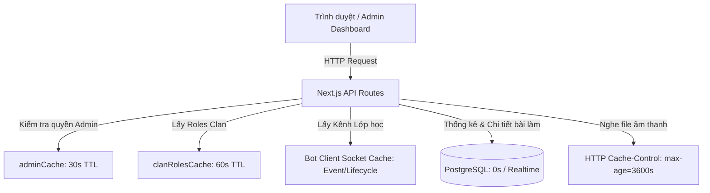

# Tài Liệu Cơ Chế Cache Quản Lý Lớp Học & Học Sinh

Tài liệu chi tiết về cơ chế, thời gian sống (TTL), và các cấp độ cache áp dụng cho các chức năng quản lý lớp học (Classrooms), học sinh (Students), và bài thi liên quan trong hệ thống.

---

## 1. Tổng quan cơ chế Cache

Hệ thống kết hợp giữa **Next.js App Router**, **Mezon Bot SDK (In-memory)** và **PostgreSQL Database** để cân bằng giữa tính chính xác dữ liệu (real-time) và hiệu năng truy vấn:

---

## 2. Chi tiết Thời gian Cache (TTL) theo từng tầng

### 2.1. Tầng API & HTTP Response (Browser / Next.js)

| Thành phần / Tuyến đường                            |   Thời gian Cache (TTL)    | Cơ chế / Cấu hình                                                                                                         | Mô tả                                                                                        |
| :-------------------------------------------------- | :------------------------: | :------------------------------------------------------------------------------------------------------------------------ | :------------------------------------------------------------------------------------------- |
| **Danh sách lớp học** `GET /api/admin/classes`   | **0 giây** _(No-store)_ | `revalidate = 0` `dynamic = 'force-dynamic'` `Cache-Control: no-store, no-cache, must-revalidate, proxy-revalidate` | Đảm bảo Dashboard luôn nhận dữ liệu cập nhật mới nhất, không bị Next.js hay Browser giữ lại. |
| **Danh sách học sinh** `GET /api/admin/students` | **0 giây** _(No-store)_ | `revalidate = 0` `dynamic = 'force-dynamic'` `Cache-Control: no-store, no-cache, must-revalidate, proxy-revalidate` | Tránh trường hợp học sinh mới làm bài hoặc mới vào lớp không hiển thị ngay.                  |
| **Client Fetch (Frontend)** `app/admin/page.tsx` |         **0 giây**         | `fetch(url, { cache: 'no-store' })` Kèm tham số chống cache: `t=${Date.now()}`                                         | Ép trình duyệt luôn gửi request mới lên server.                                              |

---

### 2.2. Tầng In-Memory Cache (Backend / Mezon Service)

Để tránh gọi dồn dập (rate-limit / flood) tới Mezon Gateway RPC, hệ thống sử dụng bộ nhớ RAM server với TTL ngắn:

| Thành phần Cache                         |               Thời gian sống (TTL)               | Vị trí định nghĩa                                             | Mục đích & Chi tiết                                                                                                                                                                                                 |
| :--------------------------------------- | :----------------------------------------------: | :------------------------------------------------------------ | :------------------------------------------------------------------------------------------------------------------------------------------------------------------------------------------------------------------ |
| **Clan Roles Cache** `clanRolesCache` |           **60 giây** _(60_000 ms)_           | `lib/mezon/bot-client.ts` (hàm `getClanRolesSafely`)       | • Lưu danh sách role của Clan. • Phân loại role `Student` và map channel tương ứng với role lớp. • Tự động xóa ngay khi có cờ `forceRefresh=true`.                                                            |
| **Clan Admin Cache** `adminCache`     |           **30 giây** _(30_000 ms)_           | `lib/admin/clan-data-service.ts` (hàm `checkIsClanAdmin`)  | • Lưu trạng thái `isAdmin: boolean` của `mezonUserId`. • Tránh spam request xác thực quyền Admin lên Mezon API mỗi khi Admin điều hướng qua các tab.                                                             |
| **Classroom Channels Cache**             | **Theo vòng đời Socket** _(Reset khi reload)_ | `lib/admin/clan-data-service.ts` (hàm `getClanClassrooms`) | • Danh sách kênh thuộc Category _"LỚP HỌC"_ lưu trong bộ nhớ socket `targetClan.channels`. • Cờ `_channelsLoaded` xác định kênh đã tải. Khi cần làm mới, cờ chuyển về `false` và tải lại qua `reloadChannels()`. |

---

### 2.3. Tầng Dữ liệu Bài làm & Media của Học sinh

| Dữ liệu                                                                   |     Thời gian Cache (TTL)     | Vị trí định nghĩa                                                        | Mô tả                                                                                                                                |
| :------------------------------------------------------------------------ | :---------------------------: | :----------------------------------------------------------------------- | :----------------------------------------------------------------------------------------------------------------------------------- |
| **Chi tiết & Lịch sử bài thi** `GET /api/admin/students/[id]/attempts` | **0 giây** _(Realtime DB)_ | `app/api/admin/students/[studentId]/attempts/route.ts`                   | Truy vấn trực tiếp từ bảng `ielts_speaking_attempts` trong PostgreSQL qua `pgDb.getStudentSpeakingDetailedAttempts(studentId)`.      |
| **File âm thanh ghi âm** `GET /api/admin/audio`                        |  **1 giờ** _(3600 giây)_   | `app/api/admin/audio/route.ts` `Cache-Control: private, max-age=3600` | Cho phép trình duyệt lưu cache cục bộ trong 1 giờ để Admin nghe lại, tua audio bài thi mà không cần tải lại file liên tục từ server. |

---

## 3. Cơ chế Xóa Cache & Đồng bộ dữ liệu (Force Sync)

Khi người quản trị thực hiện thao tác **"Đồng bộ từ Clan"** trên giao diện:

1. Giao diện gửi request kèm tham số `?refresh=true`:
   - `/api/admin/classes?refresh=true`
   - `/api/admin/students?refresh=true`
2. **Backend xử lý:**
   - Xóa `clanRolesCache` bằng `clanRolesCache.delete(clanId)`.
   - Đặt `_channelsLoaded = false` và thực thi `reloadChannels()` / `loadChannels()` với timeout 6 - 8 giây từ Mezon Server.
   - Quét lại danh sách thành viên kênh lớp học (`ListChannelUsers`) và danh sách thành viên Clan (`ListClanUsers`).
   - Cập nhật số liệu bài thi IELTS Speaking mới nhất từ PostgreSQL.
